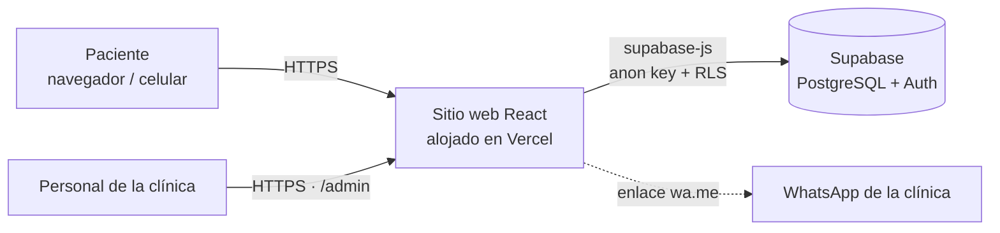
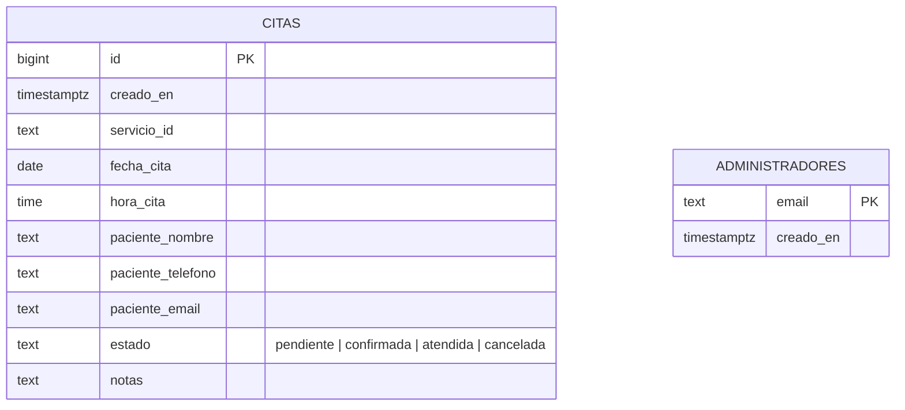
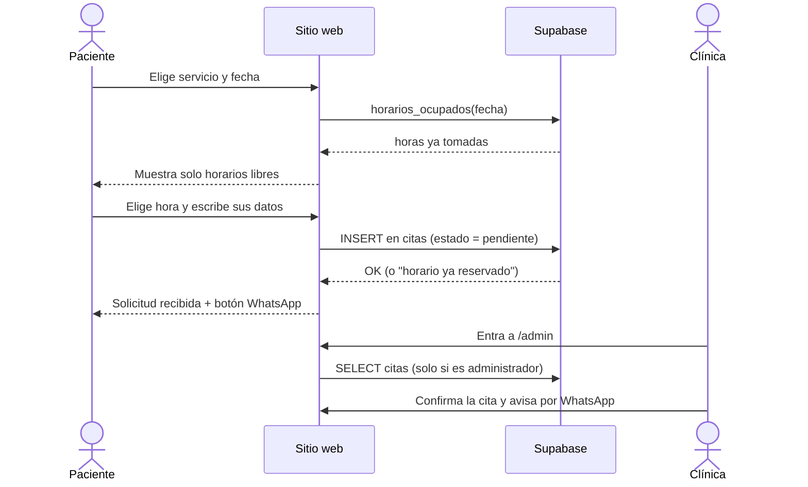

# 🦷 Mi Dentista — Sitio web y reserva de citas

Sitio web de la **Clínica Dental Mi Dentista** (Satélite Norte, Warnes – Santa Cruz, Bolivia) con
**reserva de citas en línea** y un **panel privado** para que la clínica gestione las solicitudes.

Proyecto de grado del Bachillerato Técnico Humanístico — carrera **Sistemas Informáticos**.

---

## Funcionalidades

**Para pacientes**

- Información de la clínica: servicios, proceso de atención, instalaciones, preguntas frecuentes y contacto.
- Catálogo de tratamientos con filtro por categoría, buscador y ficha de detalle.
- **Reserva de citas en 2 pasos**: servicio → fecha → horario libre → datos personales.
  - Solo muestra horarios reales: respeta el horario de atención, domingos y feriados de Bolivia/Santa Cruz,
    la anticipación mínima y los horarios **ya reservados** por otros pacientes.
  - Validación de nombre, teléfono boliviano y correo; aviso de privacidad y consentimiento.
  - Al terminar, botón para avisar a la clínica por **WhatsApp** con el resumen de la cita.
- Diseño adaptable a celulares, animaciones con GSAP y scroll suave con Lenis.

**Para la clínica** (`/admin`)

- Inicio de sesión con correo y contraseña (Supabase Auth) + verificación de que la cuenta es administradora.
- Lista de citas con vistas **Hoy / Próximas / Pasadas / Todas**, filtro por estado y búsqueda.
- Estados de la cita: **pendiente → confirmada → atendida**, o **cancelada** (y reactivar).
- Botón para escribir al paciente por WhatsApp con un mensaje de confirmación ya redactado.

**Seguridad**

- Reglas RLS: el público **solo puede crear** citas; solo los administradores pueden verlas, editarlas o borrarlas.
- Índice único que impide reservar dos veces el mismo horario.
- Validaciones en la base de datos (fechas pasadas, domingos, máximo 3 citas activas por teléfono) y campo trampa anti-bots.

---

## Tecnologías

| Capa | Herramientas |
|---|---|
| Interfaz | React 19, React Router, Tailwind CSS 4, Lucide (íconos) |
| Animación | GSAP + ScrollTrigger, Lenis |
| Datos y autenticación | Supabase (PostgreSQL, Auth, RLS, funciones SQL) |
| Herramientas | Vite 8, Vitest (pruebas), Oxlint (análisis de código) |
| Publicación | Vercel |

---

## Arquitectura



### Modelo de datos



### Flujo de una reserva



---

## Estructura del proyecto

```text
MiDentista/
├── supabase/
│   └── schema.sql            # Tablas, reglas RLS, validaciones y funciones SQL
└── Client/                   # Aplicación web (React + Vite)
    ├── public/               # favicon, robots.txt
    ├── vercel.json           # Rutas del SPA en Vercel
    ├── .env.example          # Variables de entorno necesarias
    └── src/
        ├── config/           # clinica.js (teléfono, horarios, feriados) e imagenes.js
        ├── data/             # servicios.js (catálogo de tratamientos)
        ├── lib/              # lógica: horarios, feriados, validación, citas, Supabase (+ pruebas)
        ├── hooks/            # useTituloPagina
        ├── components/
        │   ├── layout/       # Navbar, Footer, ScrollManager
        │   ├── ui/           # Modal, BrandLogo
        │   ├── booking/      # BookingForm (formulario único de reserva)
        │   ├── admin/        # AdminLogin, CitasDashboard
        │   ├── seo/          # Datos estructurados para Google
        │   └── sections/     # Secciones de cada página (home, services, contact)
        ├── pages/            # Una por ruta: /, /servicios, /contacto, /agendar, /admin, /privacidad
        ├── App.jsx           # Rutas y layout
        └── main.jsx
```

---

## Cómo ejecutarlo en tu computadora

Requisitos: **Node.js 20.19 o superior** y una cuenta gratuita en [Supabase](https://supabase.com).

```bash
cd Client
npm install
cp .env.example .env.local   # y completa los valores
npm run dev                  # http://localhost:5173
```

| Comando | Qué hace |
|---|---|
| `npm run dev` | Servidor de desarrollo |
| `npm run build` | Genera la versión de producción en `dist/` |
| `npm run preview` | Sirve la versión de producción localmente |
| `npm run lint` | Revisa el código con Oxlint |
| `npm test` | Ejecuta las pruebas automáticas (Vitest) |

### Configurar Supabase

1. Crea un proyecto en Supabase (o restaura el existente si está pausado).
2. En **SQL Editor**, ejecuta todo el archivo [`supabase/schema.sql`](supabase/schema.sql).
3. En **Authentication → Sign In / Providers → Email**, desactiva **"Allow new users to sign up"**.
4. En **Authentication → Users → Add user**, crea la cuenta de la clínica
   (su correo debe estar en la tabla `administradores`; el script ya agrega `midentista114@gmail.com`).
5. Copia **Project URL** y **anon public key** (Project Settings → API) a `Client/.env.local`.

> En el plan gratuito, Supabase **pausa los proyectos sin actividad**. Antes de una demostración,
> entra al panel de Supabase y verifica que el proyecto esté activo.

### Publicar en Vercel

1. Importa el repositorio en Vercel y elige **`Client`** como *Root Directory*.
2. Agrega las variables `VITE_SUPABASE_URL` y `VITE_SUPABASE_ANON_KEY` en *Environment Variables*.
3. Deploy. El archivo `vercel.json` hace que las rutas (`/servicios`, `/admin`, …) funcionen al recargar.

---

## Personalización

- **Teléfono, correo, dirección, redes, horarios y feriados:** [`Client/src/config/clinica.js`](Client/src/config/clinica.js).
  Todo el sitio (y los horarios de reserva) se actualiza desde ahí.
- **Tratamientos:** [`Client/src/data/servicios.js`](Client/src/data/servicios.js).
- **Fotos:** [`Client/src/config/imagenes.js`](Client/src/config/imagenes.js). Las de Unsplash son ilustrativas;
  reemplázalas por fotos reales de la clínica en `Client/src/assets/clinica/`.

---

## Créditos

- El diseño visual inicial parte del template **DentaPremium** de
  [Ashis Chetia](https://github.com/AshisChetia/DentaPremium---Dentist-Website-) (publicado como open source, licencia MIT).
- Sobre esa base se desarrolló: la adaptación del contenido a la clínica, el sistema de reservas con horarios reales,
  la base de datos con reglas de seguridad, el panel de administración, las rutas, las pruebas automáticas y la accesibilidad.
- Fotografías ilustrativas: [Unsplash](https://unsplash.com). Fotografía del consultorio: Mi Dentista Clínica Dental.

**Autor:** _Sebatián Duran Cuenca_ — [@sebastiandurancuenca259-blip](https://github.com/sebastiandurancuenca259-blip)
